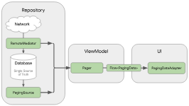

# NewsApi
API
https://newsapi.org/ 
***
## 사용한 라리브러리 및 기술
- [Coroutine](https://developer.android.com/kotlin/coroutines?hl=ko)
- [Room](https://developer.android.com/topic/libraries/architecture/room)
- [Lifecycle-aware components](https://developer.android.com/topic/libraries/architecture/lifecycle)
- [ViewModels](https://developer.android.com/topic/libraries/architecture/viewmodel)
- [LiveData](https://developer.android.com/topic/libraries/architecture/livedata)
- [Paging](https://developer.android.com/topic/libraries/architecture/paging/)
- [ViewBinding](https://developer.android.com/topic/libraries/view-binding)
- [Kotlin DSL](https://developer.android.com/studio/build/migrate-to-kts?hl=ko)
- [Version Catalog](https://developer.android.com/build/migrate-to-catalogs)
- [Hilt](https://developer.android.com/training/dependency-injection/hilt-android?hl=ko)
- [Glide](https://github.com/bumptech/glide)
- [Retrofit](https://square.github.io/retrofit/)
- [RemoteMediator](https://developer.android.com/topic/libraries/architecture/paging/v3-network-db)

***
기본 아키텍쳐는 Anroid Clean Architecture를 사용하였습니다.

로컬 데이터 저장을 위해서 Room을 사용하고
API, 로컬 데이터를 사용하기 위해 RemoteMediator을 사용하였습니다.
Glide downloadOnly를 사용하여 이미지를 로컬에 별도로 저장한 뒤에 DB에 저장하여 이를 사용하였습니다.